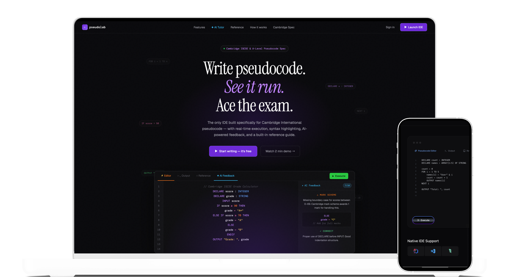
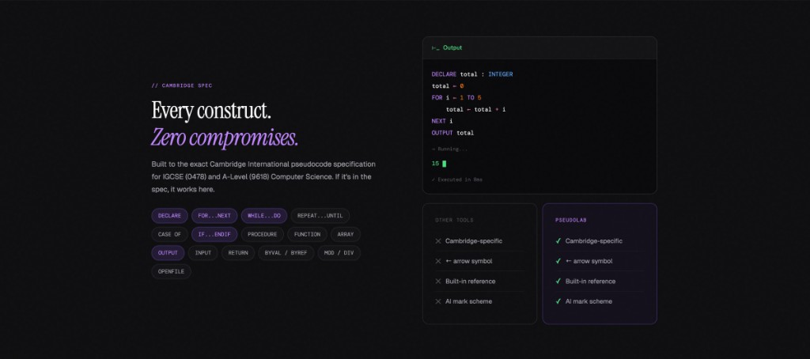
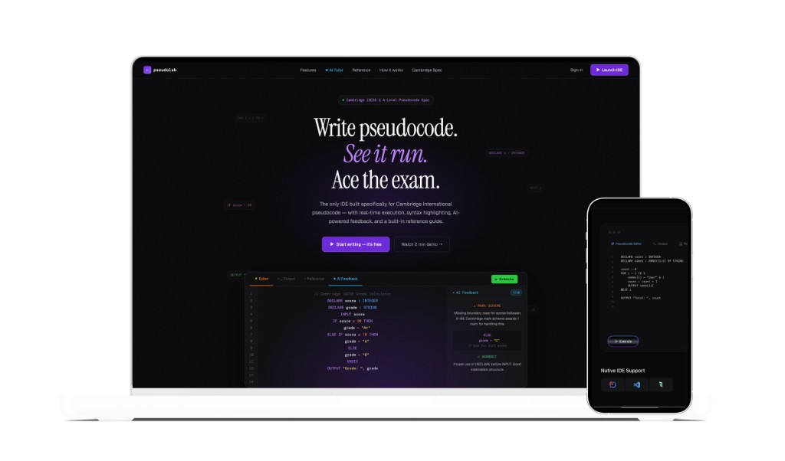
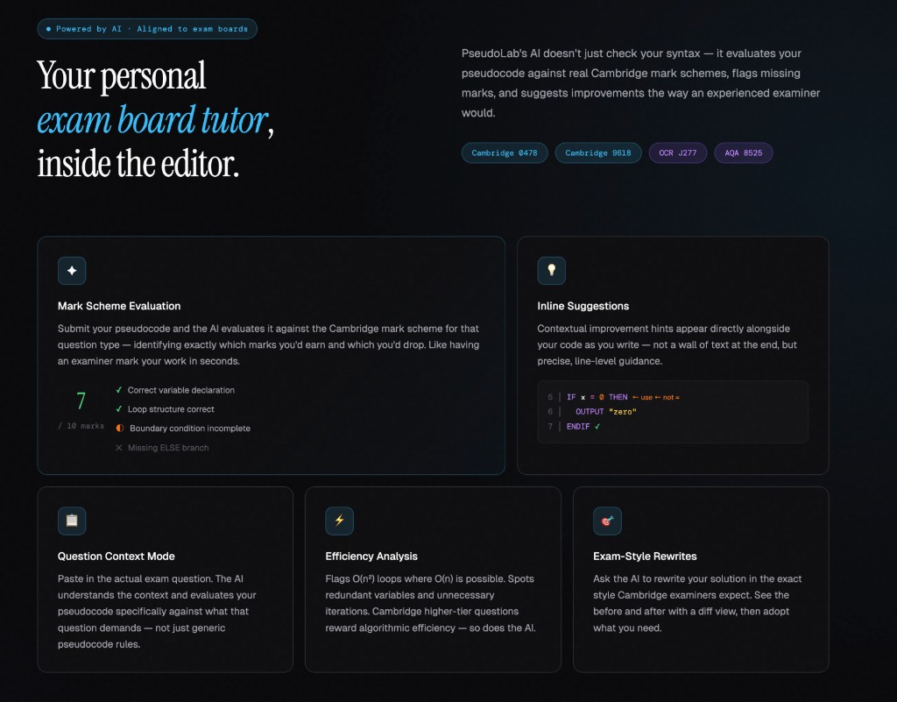
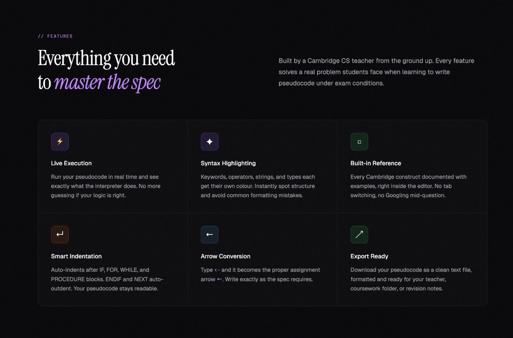

<div align="center" style="background: white; padding: 2rem; border-radius: 8px;">

# PseudoLab

**Open-source browser-based Cambridge Pseudocode IDE** built with Next.js and TypeScript. Real-time execution to help GCSE and A-Level exam students grasp abstract algorithmic concepts.

[](https://nextjs.org)
[](https://www.typescriptlang.org/)
[](LICENSE)

</div>

---

<div style="background: white; padding: 2rem; border-radius: 8px;">

<p align="center">



</p>

<p align="center">
  <em>Write pseudocode. See it run. Ace the exam.</em>
</p>

</div>

---

<div style="background: white; padding: 2rem; color: #333;">

## About

PseudoLab is the only IDE built specifically for **Cambridge International pseudocode** — with real-time execution, syntax highlighting, AI-powered feedback, and a built-in reference guide. Whether you're preparing for IGCSE (0478) or A-Level (9618) Computer Science, PseudoLab helps you learn by doing.

### Why PseudoLab?

- **Cambridge-specific** — Built to the exact specification, not a generic code editor
- **Arrow symbol support** — Type `<-` and get the proper assignment arrow `←`
- **Built-in reference** — Every construct documented with examples, right inside the editor
- **AI mark scheme** — Get feedback aligned to real Cambridge marking criteria

---

## Features

### Everything you need to master the spec

Built by a Cambridge CS teacher from the ground up. Every feature solves a real problem students face when learning to write pseudocode under exam conditions.

<p align="center">
  
</p>

| Feature | Description |
|---------|-------------|
| **Live Execution** | Run your pseudocode in real time and see exactly what the interpreter does. No more guessing if your logic is right. |
| **Syntax Highlighting** | Keywords, operators, strings, and types each get their own colour. Instantly spot structure and avoid common formatting mistakes. |
| **Built-in Reference** | Every Cambridge construct documented with examples, right inside the editor. No tab switching, no Googling mid-question. |
| **Smart Indentation** | Auto-indents after IF, FOR, WHILE, and PROCEDURE blocks. ENDIF and NEXT auto-outdent. Your pseudocode stays readable. |
| **Arrow Conversion** | Type `<-` and it becomes the proper assignment arrow `←`. Write exactly as the spec requires. |
| **Export Ready** | Download your pseudocode as a clean text file, formatted and ready for your teacher, coursework folder, or revision notes. |

---

### Every construct. Zero compromises.

Built to the exact Cambridge International pseudocode specification for IGCSE (0478) and A-Level (9618) Computer Science. If it's in the spec, it works here.

<p align="center">
  
</p>

---

### Your personal exam board tutor

PseudoLab's AI doesn't just check your syntax — it evaluates your pseudocode against real Cambridge mark schemes, flags missing marks, and suggests improvements the way an experienced examiner would.

<p align="center">
  
</p>

**Supported exam boards:** Cambridge 0478 • Cambridge 9618 • OCR J277 • AQA 8525

---

### Feature highlights

<p align="center">
  
</p>

---

## Getting Started

### Prerequisites

- Node.js 18+ 
- npm, yarn, pnpm, or bun

### Installation

```bash
# Clone the repository
git clone https://github.com/your-username/pseudolab.git
cd pseudolab

# Install dependencies
npm install

# Run the development server
npm run dev
```

Open [http://localhost:3000](http://localhost:3000) in your browser.

### Build for production

```bash
npm run build
npm start
```

---

## Tech Stack

- **[Next.js 16](https://nextjs.org/)** — React framework with App Router
- **[TypeScript](https://www.typescriptlang.org/)** — Type safety
- **[Tailwind CSS](https://tailwindcss.com/)** — Styling
- **[React 19](https://react.dev/)** — UI library

---

## Project Structure

```
pseudolab/
├── app/
│   ├── components/      # Reusable UI components
│   ├── pages/           # Route pages (about, blog, ai-tutor, etc.)
│   ├── layout.tsx       # Root layout
│   └── page.tsx         # Home page
├── docs/
│   └── images/          # README and documentation assets
└── public/              # Static assets
```

---

## Contributing

Contributions are welcome! Please feel free to submit a Pull Request.

1. Fork the repository
2. Create your feature branch (`git checkout -b feature/amazing-feature`)
3. Commit your changes (`git commit -m 'Add some amazing feature'`)
4. Push to the branch (`git push origin feature/amazing-feature`)
5. Open a Pull Request

---

## License

This project is open source and available under the [MIT License](LICENSE).

---

<div align="center">

**PseudoLab** — *Helping students ace pseudocode, one line at a time.*

</div>

</div>
